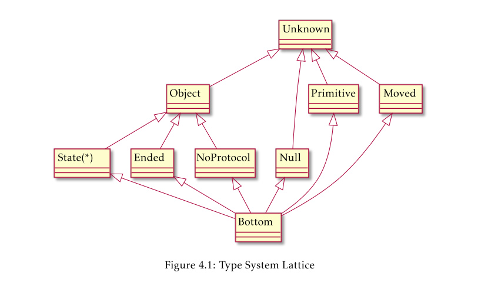

# How Jatyc Works

In this document I will attempt to compile findings on the inner workings of the Jatyc tool. Despite being uploaded in a public github repo, official documentation or papers on this are not so direct to find, and my main lead is a msc thesis pdf explaining how the initial version worked. This had one or two extra features that the current version does not, and lacks support for some functionality that it currently does. Despite this, the explanation is so complete and the tool it describes is so similar that I assume they must've kept most of the inner workings the same.

[Link to the original msc thesis](https://github.com/jdmota/java-typestate-checker/blob/master/docs/msc-thesis.pdf).

## Initial Version - Type-checker

From chapter 4.2, where the thesis explains the features that their initial Jatyc tool has, we can observe some differences between it and the current version. Here are what I consider to be the most important distinctions (there probably are more).

Some extra features include:

- **State Refinement** (chapter 4.2.2): In this version, one can write an `@Ensures` annotation not only for return types but also for method parameters. While I did not test it, the [documentation on the current tool](https://github.com/jdmota/java-typestate-checker/wiki/Documentation#ensures-annotation) is specific on this apparently only working on returning types. In fact, the original tool did not support using the `@Ensures` annotation in the return type at all, but they did have a different one for the same functionality: `@State`.
  - Tested [here](https://github.com/Mlako26/jatyc-analysis/blob/main/docs/power_and_limitations_of_jatyc.md#parameter_ensures)
- **Linearity**: While the paper does describe how a second version of the tool might enforce linearity in a more relaxed way, the explanation for the first version seems to not allow to share a reference to the same object. That is, if there are multiple references to the same object, ensuring that the protocol is followed and completed is harder, and the current version does so with strict linearity (no more than one reference can alter the protocol of the object).

According to section 4.3 of the thesis, the tool basically analyzes each class on their own, going method for method in two phases. A first one infers the types of the variables and fields. A second one uses these inferred types to report errors when type incompatibilities are detected or invalid operations are performed. Also it ensures that protocols are completed and objects are used in a linear way.

### First Phase: Type Inferring

Jatyc uses this phase to infer even more types than the ones Java already infers statically. To do this, the tool uses the following lattice (the picture was taken from the thesis):

.

Their descriptions are:

- Unknown: All possible values.
- Primitive: All primitive values from Java, like integers.
- Object: All objects, excluding null.
- Null: The null value.
- Moved: Object was passed as a parameter to a method or assigned to another value. These variables can NO LONGER BE USED.
- NoProtocol: Objects that don't follow a protocol.
- Ended: Objects which completed the protocol.
- State*: Object in a specific state of their protocol. There is one lattice type for each state of the protocol, for each protocol.
- Bottom: Conceptually the empty set. Allows for all operations. Used for unreachable variables, computations that might generate errors, etc.

There are a couple of rules that the implementation follows:

- The type of a variable/field can be one of these or the union of multiple ones.
- There are no unions within unions.
- A set with the unknown type is just the unknown type.
- A set with only one tye is just that type.
- An empty set is the Bottom type.
- Unions don't include Bottom since it is the empty set.
- If Object is present in an union, NoProtocol/Empty/State* are not since they are already subtypes.

The following are the steps that the tool follows in this phase to infer the types of variables and fields.

1. Visit each class independently.
2. If the class does not have a protocol, assume trivial one where has one state, droppable, all methods available and lead to the same state.
3. Analyze the **non-static** methods in the order of the protocol (this is to avoid analyzing invalid sequences of method calls), starting from the constructor. This process is called *class analysis*. 

#### Class Analysis

In a nutshell, from an initial state, it goes from top to bottom for each expression in the method, and tracks the type for each variable/field similar to other lattice based static checkers. The following is a more detailed description of how it works, but the full algorithm can be seen in section 4.3.2 and 4.3.3 of the thesis.

To analyze a particular method, the following rules are followed:
   - Expressions are analyzed independently.
   - For each expression, call a *transfer* function which accepts a pair of *stores* and returns another pair of *stores*. A *store* is a mapping between all variables/fields to their respective types. For the pair of *stores* that the *transfer* function returns, the first one is the *then store* (if the current expression evaluates to true) and the second the *else store* (if it evaluates to false). If the expression does not evaluate to a boolean, these two should be the same. The input for the *transfer* function is the result of the previous expression.
   - For the first expression (where there is no previous one for input for the *transfer* function), the input is the *entry store*.
   - For the last expressions (could be multiple), their results are merged to produce the *exit store*.
   - Both *entry stores* and *exit stores* work as pre-post conditions of a method.
   - Merging stores is a store that includes all variables/fields in the two stores, and if the same variable/field is present in both of them, their new type is the union of their correspondent types.

The algorithm keeps track of two sets:

- A state (from the protocol) to store.
- A method to store.

In the beginning, all methods and states start with an empty store, which assigns the type *bottom* to all variables/fields. The algorithm then infers the initial types of the fields by analyzing the constructor method, and associates the *exit store* with the initial state from the protocol. It then pushes the initial state into a queue.

It then starts to process all states within the queue doing the following:

1. It loops through all methods reachable from that state.
2. For each of them, it merges the state store and the method store, and sees if it is different from just the method store. 
3. If it isn't, then the method was already analyzed with the same store and thus it is skipped.
4. Otherwise, the method has its store updated in the set and then analyzed with it as *entry store*.
5. The *exit store* from the method analysis is then merged with the destination state store, and sees if it is different from just the destination state store.
6. If it isn't, then nothing happens.
7. If it is, then the destination state has its store updated and then queued for future analysis.

The algorithm stops when there are no more states in the queue to process, thus having checked all possible combinations of call sequences and all possible types for the variables and fields.

#### Type Inferring

For this section, it is unclear if the current working of Jatyc is the same, and I strongly believe it might defer in several places due to the differences between versions. Nonetheless, I thought they might probably be close enough.

For each expression analyzed, the following is how the tool updates information on the types of variables or parameters. Remember that they are assigned a type from the previously mentioned lattice. 

- *java.lang.Object* are assigned *Object*.
- Primitive types such as integers are assigned *Primitive*.
- Null values are assigned *Null*.
- Variables/fields that are instances of a class without protocols are assigned *NoProtocol*.
- For return types of methods, it is the declared `@State` annotation (equivalent to the current `@Ensures` annotation) or the union of all the states in the protocol except *end*.
  - Unless the method is from a library, which cannot be analyzed. Unless declared in a stub file, it is assigned *Unknown*.
- For parameters, the initial value is the ones specified in the `@Requires` annotation or the union of all possible states except *end* (It works a bit differently now, the parameter is simply a shared reference).
- For public fields, the type is *Unknown*.
- For private fields and local variable declarations, initial type is the union of all states in the protocol.
- For instantiations of an object with protocol, they are assigned te initial state.
- For assignments x = y, x becomes the type of y, and y becomes *Moved* (if it used to be an object type). This is to ensure linearity.
- For return statements, the type of the returned expression becomes *Moved*.
- For method calls on object types with protocols, the resulting protocol is the destination state after calling that specific method. If they are *NoProtocol* they stay the same.
- For method calls on objects that has *Ended*, *Moved*, *Null* or *Primitive* type, or if the method is not available in their state, it is assigned *Bottom*. Method calls are not allowed on those.
- For method calls on objects of union of types, they are assigned the subprocessing of each subtype with the previous rules.
- The arguments for method calls are assigned *Moved* unless specified with the `@Ensures` annotation.

### Second Phase: Error Checking

In this phase, all expressions are checked for:

- Type incompatibilities, such as the variable/field being a correct type for a method call.
- Unsafe operations, such as method calls on potential null objects.
- Protocol completion by the end of methods.

In particular:

- For assignments x = y, it ensures that y is of subtype required by x.
- For assignments x = y, if x is an object with protocol, it must be of type *Ended*, *Moved* or in a droppable state. Otherwise we would lose the reference, and the object would not complete its protocol.
- For return statements, the expression must be a subtype of the expected return type for the method.
- For return statements, the returned expression must be assigned to a variable so that it can finish its protocol, unless it is returned in a droppable state.
- For method calls, the receiver must be in a state that allows for that method to be called. Also, arguments need to be subtypes of the expected parameter types.
- For protocol completion, it checks the *exit store* of all methods analyzed. For every variable, their type should be the one stated by the `@Ensures` notation, or *Ended*(protocol completed)/*Moved*(delegated), or in a state that is droppable.

## Second Version - Alliasing and Linearity Checking

For now, I will not explain how this works more. I will if my tutor says so. This is because it explains how another version of the tool which supports alliasing could work, but it is currently being implemented in a separate branch from master for the tool ([`non-linear-mode](https://github.com/jdmota/java-typestate-checker/tree/non-linear-mode)) which has not gotten a single commit since 2021. It apparently is simply an experimental branch.

In chapter 7 of the msc thesis, the authors describe a second version for the tool, one which attempts to also take into account **alliasing**. Remember how in the first version of the tool having multiple references to the same protocoled object meant that only one could have access to it, while the rest were unusable variables. This second version attempts to improve this functionallity by introducing a **language of assertions**, allowing the tool to give more freedom and code expressability to use alliasing.

### Language of Assertions

In the language, assertions are built up from conjunctions of 5 basic predicates:

- **Access**: Specifies permissions over an *access location*, which are variables, the object that they may point to (if there is one), and object fields.
  - Permissions are specified with a fractional number between 0 (no access) and 1 (full read/write access). If the value is in between, there is only read access to the location.
- **Equalities**: Specifies that two variables or fields point to the same object (memory address).
- **Typeof**: Specifies the type for a variable of field.
- **Packed/Unpacked**: Specifies whether the concrete types of an object are exposed or hidden. We will expand on this later.

By following the usage depicted in the thesis, the language guarantees that all objects follow their protocols (even when there is alliasing). (there is more here to explain but I'm pausing it here).