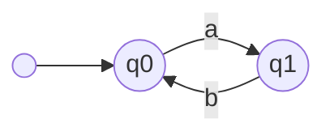
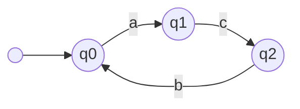
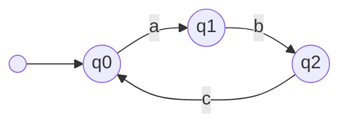
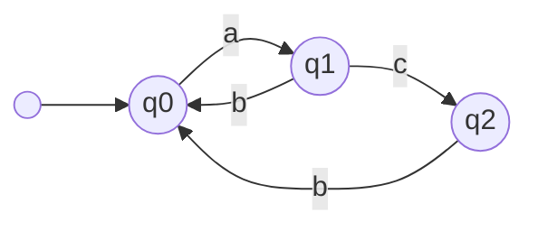

# Power and Limitations of Jatyc

The object of study of this project is the Jatyc tool. We will attempt to figure out how powerful it is and what its limitations are. The aim of this document is to compile a new test suite, with each test case targeting different points of interest within the functionality of the tool.

## Test Case Structure

Each test case described in this file will stick to the following structure:

- Name of the test.
- Aim of the test: what we want to test and why is it of interest.
- Implementation the test: which classes are involved and how they will interact, including class diagrams and pseudocode if necessary.
- Expectations of the test: Given the implementation, what we think will jatyc do or why the given implementation makes sense given the aim of the test.
- Results of the test: what happened when the test was ran.
- Conclusions of the test: what we can learn of the tool based on the results of the test.
- Extra notes of the test: Things of note or realizations that appeared during the writing and execution of the test case.

## Test Cases

### collaborator_compound_typestate

This example can be found [here](https://github.com/Mlako26/jatyc-analysis/tree/main/tests/collaborator_compound_typestate).

#### Aim

We want to see how much does Jatyc take into account the state of internal collaborators of an object following a protocol. In particular, jatyc seems to interpret a typestate as a set of enabled methods and their destination typestates. But could the typestate of an object be dictated also by the one of an internal collaborator? That is, could the typestate of the parent object be a compound of both typestates, where calls to the same method from the same parent typestate yield different results (such as an exception for example)?

#### Implementation

Create a Robot and RobotController class. The map that the robot will traverse is a 2x2 map and, starting out in the top left corner (coordinates (0,0)), it will have methods to move a single unit at a time in any cardinal direction. It will have a typestate for each position in the map, dictating which methods it can call so that it does not fall off the map.

The controller simply takes user input and then moves the robot. Its methods will be two simple ones with a boolean returning method `canMoveRobot()`, which "checks its connection to the robot", and then `move(direction: string)` which moves the robot on the corresponding direction. The protocol will consist of only two typestates, one for each method. 

There will be client code with instructions that will make the robot fail its protocol, but not the controller.

#### Expectations

For this example in particular, Jatyc should be able to tell from the client code which will explicitly show the movements the robot will make that it will break its protocol.

#### Results

Our first implementation had the controller receive in its constructor the robot to be controlled.

```java
	public RobotController(Robot robot) {
		this.robot = robot;
	}
```

This made it so Jatyc interpreted the robot as a *shared* reference, thus no method calls would work. For example:

```
RobotController.java:24: error: Cannot call [moveDown] on Shared{Robot}
                                this.robot.moveDown();
```

When instead implementing it so that it created its own robot within the constructor, and using the following client code:


```java
public class Main {
    public static void main(String args[]) throws Exception {
		RobotController controller = new RobotController();

		if (controller.canMoveRobot()) {
			controller.move("right");
		}
    }
}
```

We got the following errors:

```
RobotController.java:27: error: Cannot call [moveLeft] on State{Robot, TopLeft}
                                this.robot.moveLeft();
                                                   ^
RobotController.java:21: error: Cannot call [moveUp] on State{Robot, TopLeft}
                                this.robot.moveUp();
                                                 ^
2 errors
```

What this tells us is interesting. Since the robot starts at position topleft, the tool will not allow us to simply create a switch statement moving the robot around, and it blocks off both invalid methods that would break the protocol. 

We would need to add more methods to the `RobotProtocol`, such as new boolean returning methods that enable certain movements based off of the robot's current position. 

Trying to trick the system by adding private methods also doesn't work:


```java
	public void move(String direction) {
		switch (direction) {
			case "up":
				this.moveUp();
				break;
			case "down":
				this.moveDown();
				break;
			case "left":
				this.moveLeft();
				break;
			case "right":
				this.moveRight();
				break;
			default:
				throw new RuntimeException("Invalid direction of movement");
		}
	}

	private void moveLeft() {
		this.robot.moveLeft();
	}

	private void moveRight() {
		this.robot.moveRight();
	}

	private void moveDown() {
		this.robot.moveDown();
	}
	
	private void moveUp() {
		this.robot.moveUp();
	}
```

But it yields new interesting findings!

```
RobotController.java:42: error: Cannot call [moveRight] on Shared{Robot}
                this.robot.moveRight();
                                    ^
RobotController.java:50: error: Cannot call [moveUp] on Shared{Robot}
                this.robot.moveUp();
                                 ^
RobotController.java:46: error: Cannot call [moveDown] on Shared{Robot}
                this.robot.moveDown();
                                   ^
RobotController.java:7: error: [this.robot] did not complete its protocol (found: Shared{Robot} | State{Robot, ?})
public class RobotController {
       ^
RobotController.java:38: error: Cannot call [moveLeft] on Shared{Robot}
                this.robot.moveLeft();
                                   ^
5 errors
```

It seems that when calling a new method, the internal collaborator becomes a shared variable even if not provided as an argument to the method. Changing its visibility to `Public` did not change this result.

Trying to trick it even further by adding a `@Requires` statement at the method declaration also did not work:

``` java
	private void moveLeft(@Requires({"TopRight", "BotRight"}) Robot robot) {
		robot.moveLeft();
	}

	private void moveRight(@Requires({"TopLeft", "BotLeft"}) Robot robot) {
		robot.moveRight();
	}

	private void moveDown(@Requires({"TopLeft", "TopRight"}) Robot robot) {
		robot.moveDown();
	}
	
	private void moveUp(@Requires({"BotLeft", "BotRight"}) Robot robot) {
		robot.moveUp();
	}
```

Returning errors similar to the first one

```
RobotController.java:18: error: Incompatible parameter: cannot cast from State{Robot, TopLeft} to State{Robot, BotLeft} | State{Robot, BotRight}
                                this.moveUp(this.robot);
                                                ^
RobotController.java:24: error: Incompatible parameter: cannot cast from State{Robot, TopLeft} to State{Robot, BotRight} | State{Robot, TopRight}
                                this.moveLeft(this.robot);
                                                  ^
2 errors
```

Seems like this might just be a restriction that the programmer will have to live with in order to write "safer code" and use the tool freely.

#### Conclusion

Seems like there is a pretty strong limitation with Jatyc where it does not really care about client code if we are talking about the typestate of an internal collaborator. We could be sure that the robot would not fall of the map, and it still would not care.

We need to explicitly delcare with boolean returning methods the current typestate we are in and therefore the methods that are available to the internal collaborator.

#### Extra notes

- Is an object able to read the current typestate of an internal collaborator and make different decisions based off of it? Perhaps land in different typestates? 
  - Does not seem like it. More likely it will use the methods available in the current typestate, which might provide some information into the next typestate of the collaborator and its available methods.
- I could create a test for it, but I'm pretty sure that even with having user inputted robot movements (so that Jatyc can't know which way the robot might go beforehand) would also result in the same error. This makes a lot of sense, since where Jatyc puts emphasis on is that you use objects safely, no matter which methods you call. That is, always verify the typestate you are on before calling a certain methods.

### normal_stack

This example can be found [here](https://github.com/Mlako26/jatyc-analysis/tree/main/tests/normal_stack).

#### Aim

Within the Four Dark Horses of Object Protocols paper, there is an example in section 2.1 mentioning the difficulty of protocols to properly analyze a stack state. The paper claims that to 100% do so, one needs a sort of stack automata to count the amount of push and pops.

This example aims to display the philosophy behind the Jatyc tool, which gives a twist on the paper's interpretation of object protocols. A fully functional stack protocol and obeying implementation can be achieved by being stricter on how a programmer can use an instance of the stack.

#### Implementation

Create a simple stack implementation with methods `push()`, `pop()`, `isEmpty()`, `isFull()`.

The protocol will be a simple one, where one can only push if the stack is not full, and pop if it's not empty.

```
typestate StackProtocol {
  Init = {
    boolean isEmpty(): <true: Init, false: CanPop>,
    boolean isFull(): <true: Init, false: CanPush>,
    drop: end
  }
  CanPush = {
    boolean isEmpty(): <true: Init, false: CanPop>,
    boolean isFull(): <true: Init, false: CanPush>,
    boolean push(T): Init,
    drop: end
  }
  CanPop = {
    boolean isFull(): <true: Init, false: CanPush>,
    boolean isEmpty(): <true: Init, false: CanPop>,
    T pop(): Init,
    drop: end
  }
}
```

There will be client code attempting to push or pop without first checking if it can.

#### Expectations

Jatyc will be able to tell that the client code is wrongly calling the stack's methods in all scenarios.

#### Results

I first tried doing this test with a stack supporting any kind of variable, using generics, but Jatyc started complaining. Then I remembered that they mentioned that limitation in their documentation:

```
Currently, JaTyC has some limitations that we are working on:
- No overall support for generics (parametric types are non-linear and nullable by default);
```

Using integers instead as the values stored within the stack, we get the following expected error using this client code:

```java
public class Main {
    public static void main(String args[]) throws Exception {
		Stack stack = new Stack(5);
		stack.push(5);
    }
}
```

```
Main.java:4: error: Cannot call [push] on State{Stack, Init}
                stack.push(5);
                          ^
1 error
```

#### Conclusion

As expected, using Jatyc definitely ensures that callers to an object that follows a protocol do not break it.

#### Extra notes

- Within this example we can see that Jatyc **DOES NOT** control the actual implementation of the stack, but whether if the client code properly traverses its typestates.

### faulty_stack

This example can be found [here](https://github.com/Mlako26/jatyc-analysis/tree/main/tests/faulty_stack).

#### Aim

Following the previous example, as far as we know Jatyc is unable to tell if an implementation actually does what it is supposed to. That is, it verifies that the usage of an object follows its protocol, but not that an object's methods follow some sort of **specification** (pre-post condition). 

While it registers that client code could be using an object in a way that it breaks its protocol, it does not control whether a boolean method simply returns a random value instead of what it actually should.

#### Implementation

Create a simple stack implementation with methods `push()`, `pop()`, `isEmpty()`, `isFull()`. Method `isFull()` will always return false.

The protocol will be the same as the previous example.

Finally, the client code will create a new instance of the faulty stack and then push more times than its capacity.

#### Expectations

Jatyc will not be able to tell that the implicit stack's specification is not being followed, and an exception will be thrown when pushing the final element.

#### Results

Using the following implementation for the `isFull()` method and client code we got Jatyc to compile.

```java
	public boolean isFull() {
		return false;
	}
```

```java
    public static void main(String args[]) throws Exception {
        Stack stack = new Stack(1);
        while (!stack.isFull()) {
            stack.push(5);
        }
    }
```

#### Conclusion

As expected, the tool's purpose is not to verify a "correct" implementation. Just that its method calls are in the correct order.

#### Extra notes

- If this test follows our expectations, it means that indeed jatyc, and perhaps protocols in general, are not able to assert that specifications are being followed within an object's methods. In that sense, pre-post conditions are perhaps more expressive and powerful in this area.

### restrictive_iterator

This example can be found [here](https://github.com/Mlako26/jatyc-analysis/tree/main/tests/restrictive_iterator).

#### Aim

With this example we aim to show how a protocol could be too restrictive for a particular implementation. This is similar to how a pre-post condition could overspecify a method.

#### Implementation

Have a class `BaseIterator` with the protocol that is provided by the Jatyc tool. In particular, this protocol only allows you to call the `next()` method if `hasNext()` returns true.

Then create a subclass that implements the methods of the interface, but called the `LoopIterator`. Calling the `next()` method on an instance of this class when the end of the collection has been reached, the iterator will loop back to the beginning of the collection and start again. The `hasNext()` method will work as usual, where it returns true at all stages except when the end of the collection is reached.

We can try this example both with a subprotocol, where `next()` can be called even if `hasNext()` returns false, and without one (`LoopIterator` would follow the abstract class' protocol).

Finally, have the client code simply make a loop of `hasNext()` and `next()` calls, and then a final `next()` call when it exits the loop. This technically will not raise an exception and is expected behavior for the object, but not for the protocol.

#### Expectations

Jatyc will not let the client use the `next()` method if `hasNext()` returns false. In the case of the `LoopIterator` following a subprotocol, Jatyc might not even allow the protocol to inherit from the parent one.

#### Results

This is the client code that was used.

```java
    public static void main(String[] args) {
        BaseIterator it = new LoopIterator(args);
        while (it.hasNext()) {
			it.next();
		}
		it.next();
	}
```


I first tried this test without having the `LoopIterator` subclass follow a protocol. As expected, we got the following error message:

```
ClientCode.java:9: error: Cannot call [next] on State{LoopIterator, end}
                it.next();
                       ^
1 error
```

This time, I created a new protocol for the subclass which allow to use the `hasNext()` and `next()` methods all the time.

```
typestate LoopIterator {
  Init = {
    boolean hasNext(): <true: Init, false: Init>,
    Object next(): Init,
    drop: end
  }
}
```

This time it worked. This makes sense since the subprotocol allows **more** method calls than the parent protocol. This means that no matter which class we use to create a `BaseIterator`, it will follow both protocols. Remember how in the documentation of the tool it states that:

```
The tool also has support for subtyping. This means that you may have a class with a protocol that extends another class with another protocol and the tool will ensure that the first protocol is a subtype of the second one.
```

Finally, just to check, I created a new `ClientCode2` example where I left both protocols working, but instead of creating a `LoopIterator` as is I upcasted it to a `BaseIterator`. It failed again.

```java
    BaseIterator it = new LoopIterator(args);
```

```
ClientCode2.java:9: error: Cannot call [next] on State{BaseIterator, end}
                it.next();
                       ^
1 error
```

#### Conclusion

We should probably review how the algorithm for subtyping support works, which is detailed in a paper linked by the developers of the tool. I don't believe it did in this case what it should've been doing.

#### Extra notes

### lax_iterator

This example can be found [here](https://github.com/Mlako26/jatyc-analysis/tree/main/tests/lax_iterator).

#### Aim

Following the previous examples where the protocol managed to be more restrictive than needed, and sometimes not allowing the objects to perform all of their features, this example will showcase how a protocol badly written might prove to be too lax. That is, having a class that, despite its method calls following a protocol, the execution raises an unwanted exception.

#### Implementation

Have a `BaseIterator` class with the usual protocol that is provided by the Jatyc tool. In particular, this protocol only allows you to call the `next()` method if `hasNext()` returns true.

Have a subclass `EvenIntIterator`, which iterates over arrays of integers. In the case that an odd number is encountered within the collection, it will raise an exception in the `next()` method. It will follow the same protocol as the parent class.

Finally, have a client code supply a list of items that include an odd number.

#### Expectations

Jatyc will not let the client use the `next()` method if `hasNext()` returns false. In the case of the `LoopIterator` following a subprotocol, Jatyc might not even allow the protocol to inherit from the parent one.

#### Results

Using the following client code we got the code to compile without errors.

```java
    public static void main(String[] args) {
		int[] array = {2,3};
        EvenIntIterator it = new EvenIntIterator(array);
        while (it.hasNext()) {
			it.next();
		}
	}
```

#### Conclusion

What this tells us is that Jatyc, just like doing pre and post conditions, is vulnerable to underspecification and human error prone.

#### Extra notes

- Obviously this implementation would be anything but production ready. Despite this, I find it interesting how, since Jatyc has absolutely no way of telling what the contents of the collection could be before the `next()` method is called (to disable it), the programmer will have to modify the way he implements in order to fully utilize the Jatyc protocols. That is, perhaps adding a new `nextIsOdd()` method, which can only be called between `hasNext()` and `next()`, to make sure an instance of this class does not raise exceptions.
- Do these examples make any sense? I'm not sure these are the kind of exceptions we want to examplify with (deliberately throwing an exception instead of something actually breaking).

### state_equals_typestate

This example can be found [here](https://github.com/Mlako26/jatyc-analysis/tree/main/tests/state_equals_typestate).

#### Aim

In section 2.2 of the Four Dark Corners Of Object Protocols, it mentions an example of an implementation of the `Iterator` interface that adds its own reset method, which sends its index back to the beginning of the collection. Following the protocol of the interface, since this method is not mentioned Jatyc will consider it an *anytime* method. Then, calling it should not allow it to modify the state of an instance (the values of its internal collaborators).

But does modifying the state of an instance mean modifying the typestate? Remember what the documentation says about the typestates:

```
A typestate is associated with a Java class with the @Typestate annotation and defines: the object's states, the methods that can be safely called in each state, and the states resulting from the calls
```

I believe that not always modifying the state of an instance makes it necessarily change its typestate. That is pretty easy to see: having internal collaborators that represent a log context for example, or a timestamp for the last operation performed. Changing these would change the state of an object, but not necessarily its typestate. Therefore, were Jatyc to not allow an anytime method to modify any collaborator, we could say it is overly restrictive.

In this example, the collaborator modified will technically be of importance to the protocol, which will be the index of the array being iterater over.

#### Implementation

Have a `BaseIterator` class, with its very simple protocol including typestates for the methods `hasNext()` and `next()`.

Have a subclass of the Iterator interface, `ResettableIterator`, which adds an *anytime* method `reset()` which resets the index of the iterator to the beginning of the collection. It will have as an internal collaborators an array/list and an integer index.

Have the client code utilize this `reset()` method after a few calls of the `hasNext()` and `next()` loop.

#### Expectations

Jatyc will not compile the `reset()` method since it modifies internal collaborators despite being an *anytime* method.

#### Results

Using the following client code, compilation did not raise any errors and indeed the prints show how the index went back to 0. 

```java
    public static void main(String[] args) {
		String[] array = {"hello", "world"};
        ResseteableIterator it = new ResseteableIterator(array);
        if (it.hasNext()) {
			it.next();
		}
		it.print();
		it.reset();
		it.print();
	}
```

#### Conclusion

I find it interesting that Jatyc would not check for internal collaborators modifications within *anytime* methods. Given its quite restrictive nature, I would've assumed that it simply would not let you modify them.

Looking at the documentation there is something mentioned about this limitation though:

```
Currently, JaTyC has some limitations that we are working on:

Anytime methods cannot write to fields.
```

#### Extra notes

- An interesting next example would be to break the protocol with this.

### state_equals_typestate_2

This example can be found [here](https://github.com/Mlako26/jatyc-analysis/tree/main/tests/state_equals_typestate_2).

#### Aim

Same as previous example but showing how we can abuse this gap to cause a protocol fault.

#### Implementation

Have a `BaseIterator` class, with its very simple protocol including typestates for the methods `hasNext()` and `next()`.

Have a subclass of the Iterator interface, `ResettableIterator`, which adds an *anytime* method `moveToEnd()` which sets the index of the iterator to the end of the collection. It will have as an internal collaborators an array/list and an integer index.

Have the client code utilize this `end()` method within an if conditional of the `hasNext()` method. This should tell Jatyc that we are in a state to call the `next()` method. Instead, before doing that, call the `moveToEnd()` method.

#### Expectations

Jatyc will not raise any errors and running the code ends up in an exception.

#### Results

Compiling the test and running it indeed ends up in a `IndexOutOfBoundsException`.

```
C:\Users\mlako\OneDrive\Desktop\Stuff\Facultad\tesis\jatyc-analysis\tests\state_equals_typestate_2>java ClientCode                                                        
Exception in thread "main" java.lang.IndexOutOfBoundsException: Index 2 out of bounds for length 2
        at java.base/jdk.internal.util.Preconditions.outOfBounds(Preconditions.java:64)
        at java.base/jdk.internal.util.Preconditions.outOfBoundsCheckIndex(Preconditions.java:70)
        at java.base/jdk.internal.util.Preconditions.checkIndex(Preconditions.java:248)
        at java.base/java.util.Objects.checkIndex(Objects.java:374)
        at java.base/java.util.ArrayList.get(ArrayList.java:459)
        at ResseteableIterator.next(ResseteableIterator.java:15)
        at ClientCode.main(ClientCode.java:9)
```

This is the client code ran:

```java
    public static void main(String[] args) {
		String[] array = {"hello", "world"};
        ResseteableIterator it = new ResseteableIterator(array);
        if (it.hasNext()) {
			it.moveToEnd();
			it.next();
		}
	}
```

#### Conclusion

This is clearly still not a feature supported by the tool.

#### Extra notes

### public_stack

This example can be found [here](https://github.com/Mlako26/jatyc-analysis/tree/main/tests/public_stack).

#### Aim

With the goal of testing the flexibility of the tool, this test aims to create a class with a public internal collaborator with importance to the typestate of an instance. For example, the index of an interator. Then, we want to see what would happen were the client code to create an instance of this class and then read/modify its internal collaborator.

Would Jatyc allow any of these operations? In the case that it doesn't, then it would represent another limitation for the programmer using this tool. If it does, what would happen to the typestate of the class? Would Jatyc be able to recognize it the change?

#### Implementation

Have a `Stack` class and protocols similar to the other two done before. Then, have its `size` internal collaborator be of public visibility.

Have client code create a new instance of this class. Then, change the `size` variable to a very big number. Finally, push elements until the stack potentially runs out of space.

#### Expectations

Jatyc will not allow the client code to modify the internal state of the Stack.

#### Results

With the following client code Jatyc returned the following error:

```java
	public static void main(String args[]) throws Exception {
		Stack stack = new Stack(1);
		stack.size = 2; 
		while (!stack.isFull()) {
			stack.push(2);
		}
	}
```

```
Main.java:4: error: Cannot access [stack.size]
                stack.size = 2;
                     ^
1 error
```

#### Conclusion

Indeed Jatyc does not let client code make use of public collaborators. This makes certain sense though, helps keep object's use under control and makes code safer.

#### Extra notes

### collaborator_compound_typestate_2

This example can be found [here](https://github.com/Mlako26/jatyc-analysis/tree/main/tests/collaborator_compound_typestate_2).

#### Aim

Following up on the `collaborator_compound_typestate` test we performed earlier, results showed how Jatyc was able to recognize when a move was being performed that the robot was at the top-left corner in its initial state. We know this since the two method calls that threw a compilation error were `moveLeft()` and `moveRight()`.

```
RobotController.java:27: error: Cannot call [moveLeft] on State{Robot, TopLeft}
                                this.robot.moveLeft();
                                                   ^
RobotController.java:21: error: Cannot call [moveUp] on State{Robot, TopLeft}
                                this.robot.moveUp();
                                                 ^
2 errors
```

We wonder what would happen if instead the controller had a method `run()` which would simply move the robot around the map, in a clock-wise direction. Would Jatyc allow it, despite moving the robot without checking its state first with some sort of conditional method? What would happen if we ran it twice?

#### Implementation

Same as for the same example but with a method `run()` which first moves the robot right, then down, then left, and finally up. You can only call method `run()` if `canMoveRobot()` returned `true`.

#### Expectations

Jatyc should allow it, since after each method call the robot's state changes to one where the following method call does not break the protocol.

On the other hand, running it twice should not make a difference to jatyc, since it does not check implementations. That is, jatyc makes sure client code respects the protocol of the objects it is using, and calling the `RobotController` twice following the protocol should not raise any alarms. In other words, if the first call to the method `run()` did not raise any errors, then calling it twice shouldn't either.

#### Results

Using the following `run()` implementation and calling it only once we got **no errors**:

```java
	public void run() {
		this.robot.moveRight();
		this.robot.moveDown();
		this.robot.moveLeft();
		this.robot.moveUp();
	}
```

Calling it twice from the client code also does not raise any errors.

#### Conclusion

Seems like as long as you follow the protocol from typestate to typestate you don't need any conditionals to check the current typestate.

#### Extra notes

### collaborator_compound_typestate_3

This example can be found [here](https://github.com/Mlako26/jatyc-analysis/tree/main/tests/collaborator_compound_typestate_3).

#### Aim

Going even further with the `Robot` and `RobotController` example, we would like to now instead of having a `run()` method, what would happen if we had a `next()` method, which if called 4 times in a row it would replicate the behavior of `run()`. That is, it moves the robot one position clockwise. We also want to have a `reset()` method, which tells the controller to start the sequence from the beginning.

Does Jatyc track the typestate of internal collaborators between method calls of its parent object? Or can we somehow make an implementation of the `RobotController` and client code that will cause the robot to fall of the map?

#### Implementation

Have a new internal collaborator variable called position, which tells the controller which position de robot is in. Have a new `next()` method which moves the robot to the next position in the map clockwise. Finally, have a new `reset()` method which will reset the position variable to the top-left corner of the map (starting position).

The protocol for the robot and implementations should be the same as for the previous tests, and the protocol for the controller should be similar (client code must check that the robot can be moved before moving it).

Client code will call `next()` two times, then `reset()` and finally one more `next()` call. This should cause the controller to send the robot right from the bottom-right corner and fall of the map.

#### Expectations

I don't even think I have to test this. In order to implement the `next()` method, I have use a switch statement or many ifs to know where to move the robot to. Thus, the result of the first test will repeat, where we did a similar implementation for the `move()` method.

#### Implementation 2

Have the method `run()` but **also** a method `moveRight()`, which simply moves the robot to the right. This move should be allowed if the robot is in the starting position.

Then have the client code call `run()`, which will make the robot loop clockwise around the map and go back to the top-left starting position, `moveRight()`, causing the robot to be in the top-right position, and another `run()` call. Since the first movement of `run()` is also to the right, it should move the robot out of the map.

#### Expectations

Jatyc will not recognize this and the robot will throw an exception when it falls of the map. I believe Jatyc always assumes the internal collaborator is in the initial state.

#### Results

With this client code:

```java
public static void main(String args[]) throws Exception {
		RobotController controller = new RobotController();

		if (controller.canMoveRobot()) {
			controller.run();
		}

		if (controller.canMoveRobot()) {
			controller.moveRight();
		}

		if (controller.canMoveRobot()) {
			controller.run();
    }
}
```

and this controller implementations:

```java
public void run() {
		this.robot.moveRight();
		this.robot.moveDown();
		this.robot.moveLeft();
		this.robot.moveUp();
}

public void moveRight() {
		this.robot.moveRight();
}
```

and protocol:

```
typestate RobotControllerProtocol {
  CanMove = {
    boolean canMoveRobot(): <true: Move, false: CanMove>,
    drop: end
  }
  Move = {
    void run(): CanMove,
    void moveRight(): CanMove
  }
}
```

we got the following errors:

```
RobotController.java:23: error: Cannot call [moveRight] on State{Robot, TopLeft} | State{Robot, TopRight}
                this.robot.moveRight();
                                    ^
RobotController.java:16: error: Cannot call [moveRight] on State{Robot, TopLeft} | State{Robot, TopRight}
                this.robot.moveRight();
                                    ^
2 errors
```

Seems like it recognizes, for some reason, that the robot could be in the top-right corner and thus you cannot move right initially without "checking".

Experimenting a bit more with it, I made the client code simply call `run()` once, and thus making the robot not fall off the map. I got the same errors.

I will now create one move method for each direction to see if we get even more errors. Interestingly, when adding a new `moveDown()` method to the controller, we get a new error for that direction:

```java
public void run() {
		this.robot.moveRight();
		this.robot.moveDown();
		this.robot.moveLeft();
		this.robot.moveUp();
}

public void moveRight() {
		this.robot.moveRight();
}

public void moveDown() {
		this.robot.moveDown();
}
```

```
RobotController.java:16: error: Cannot call [moveRight] on State{Robot, TopLeft} | State{Robot, TopRight}
                this.robot.moveRight();
                                    ^
RobotController.java:27: error: Cannot call [moveDown] on Shared{Robot}
                this.robot.moveDown();
                                   ^
RobotController.java:23: error: Cannot call [moveRight] on State{Robot, TopLeft} | State{Robot, TopRight}
                this.robot.moveRight();
                                    ^
3 errors
```

But now the new error states that the robot is a shared variable somehow. Writing all of the methods gives us:

```
RobotController.java:35: error: Cannot call [moveUp] on Shared{Robot}
                this.robot.moveUp();
                                 ^
RobotController.java:31: error: Cannot call [moveLeft] on Shared{Robot}
                this.robot.moveLeft();
                                   ^
RobotController.java:23: error: Cannot call [moveRight] on State{Robot, TopLeft} | State{Robot, TopRight}
                this.robot.moveRight();
                                    ^
RobotController.java:27: error: Cannot call [moveDown] on Shared{Robot}
                this.robot.moveDown();
                                   ^
RobotController.java:16: error: Cannot call [moveRight] on State{Robot, TopLeft} | State{Robot, TopRight}
                this.robot.moveRight();
                                    ^
5 errors
```

In all methods except for the `moveRight()`, we get an error due to calling a protocol method from a shared reference (which can only use anytime methods).

If we now remove the `moveRight()` methods but leave the other three, we get a new error which tells me a lot about what was happening with the shared variable:

```
RobotController.java:4: error: Method [moveRight] is required by the typestate but not implemented
public class RobotController {
       ^
RobotController.java:23: error: Cannot call [moveDown] on Shared{Robot}
                this.robot.moveDown();
                                   ^
RobotController.java:27: error: Cannot call [moveLeft] on Shared{Robot}
                this.robot.moveLeft();
                                   ^
RobotController.java:31: error: Cannot call [moveUp] on Shared{Robot}
                this.robot.moveUp();
                                 ^
4 errors
```

This new `moveRight method was not implemented` reminded me that I didn't include the other movement methods to the protocol of the controller. After adding them to it, and re-implementing the missing method, we get:

```
RobotController.java:17: error: Cannot call [moveDown] on State{Robot, BotRight} | State{Robot, TopRight}
                this.robot.moveDown();
                                   ^
RobotController.java:16: error: Cannot call [moveRight] on State{Robot, BotLeft} | State{Robot, BotRight} | State{Robot, TopLeft} | State{Robot, TopRight}
                this.robot.moveRight();
                                    ^
RobotController.java:27: error: Cannot call [moveDown] on State{Robot, BotLeft} | State{Robot, BotRight} | State{Robot, TopLeft} | State{Robot, TopRight}
                this.robot.moveDown();
                                   ^
RobotController.java:23: error: Cannot call [moveRight] on State{Robot, BotLeft} | State{Robot, BotRight} | State{Robot, TopLeft} | State{Robot, TopRight}
                this.robot.moveRight();
                                    ^
RobotController.java:35: error: Cannot call [moveUp] on State{Robot, BotLeft} | State{Robot, BotRight} | State{Robot, TopLeft} | State{Robot, TopRight}
                this.robot.moveUp();
                                 ^
RobotController.java:31: error: Cannot call [moveLeft] on State{Robot, BotLeft} | State{Robot, BotRight} | State{Robot, TopLeft} | State{Robot, TopRight}
                this.robot.moveLeft();
                                   ^
6 errors
```

Now it seems like the tool recognizes that the robot could be anywhere, and thus we cannot simply call the methods as they are. That is very interesting and would love to investigate more how it does that. It clearly seems like it reads which methods could be called from the controller class, and maybe tests different method calls with them? 

I also am not sure why it only complained about moving the robot right and down within the `run()` method (lines 16 and 17), but not going left and up.

#### Conclusion

I feel like I really want to know the algorithm that this tool follows to ensure an object's protocol is being followed. I assume it checks the final state that the internal collaborator would be left at after each method call and colors the typestate graph but not sure.

#### Extra notes

### subtyping_iterators

This example can be found [here](https://github.com/Mlako26/jatyc-analysis/tree/main/tests/subtyping_iterators).

#### Aim

We saw how a protocol can subtype another as long as it allows **more** method sequences, but never less. We want to see what would happen if we were to implement a protocol that went from typestate A to B to A and so on, and a subprotocol that went from A to B to C to A and so on, both on a loop. Would that make Jatyc raise an error?





Would these configurations work too?





Also, what would happen if there was another subprotocol that after calling A, B and C are available, 

#### Implementation

Have a `BaseIterator` class like the previous ones, with a `hasNext()` and `next()` methods. Its protocol will be the usual:

```
typestate BaseIterator {
  HasNext = {
    boolean hasNext(): <true: Next, false: end>
  }
  Next = {
    int next(): HasNext
  }
}
```

Have a `SuperSafeIterator` class that has an additional method, `iAmSure()`, which is to be called after `hasNext()` and before `next()`. One should only be able to call `next()` if first `hasNext()` returned true and then `iAmSure()` does so too. The protocol for this class should be the following:

```
typestate SuperSafeIterator {
  HasNext = {
    boolean hasNext(): <true: Verify, false: end>
  }
  Verify = {
    boolean iAmSure(): <true: Next, false: end>
  }
  Next = {
    int next(): HasNext
  }
}
```

Have a `TiredIterator` class that has an additional method, `rest()`, which is to be called after `next()` and before `hasNext()` can be called again. The protocol for this class should be the following:

```
typestate TiredIterator {
  HasNext = {
    boolean hasNext(): <true: Verify, false: end>
  }
  Next = {
    int next(): HasNext
  }
  Rest = {
    void rest(): HasNext
  }
}
```

Have a `SafeIterator` class that has an additional method, `iAmSure()`, which can only be called after `hasNext()` and before `next()`. It allows users to call `next()` right after `hasNext()` though. The protocol for this class should be the following:

```
typestate SafeIterator {
  HasNext = {
    boolean hasNext(): <true: Verify, false: end>
  }
  Verify = {
    boolean iAmSure(): <true: Next, false: end>,
    int next(): HasNext
  }
  Next = {
    int next(): HasNext
  }
}
```

#### Expectations

I believe it should raise an error for both the `SuperSafeIterator` and `TiredIterator`. Lets suppose we have a factory that returns implementations of the `BaseIterator`. The consumer of this iterator would expect to be able to call `next()` staight away after calling `hasNext()` and viceversa, but if any of both of these were to be called this would not be possible due to its protocol.

#### Results

Indeed it raised an error as expected:

```
SuperSafeIterator.java:6: error: [next] transition(s) in [Next] of BaseIterator.protocol are not included in [Verify] of SuperSafeIterator.protocol
public class SuperSafeIterator extends BaseIterator {
       ^
TiredIterator.java:6: error: [hasNext] transition(s) in [HasNext] of BaseIterator.protocol are not included in [Rest] of TiredIterator.protocol
public class TiredIterator extends BaseIterator {
       ^
2 errors
```

It complains that the method `next()` is not included in the typestate `Verify` for the protocol of the `SuperSafeIterator`. At the same time, the transition for method `hasNext()` does not exist within the `Rest` typestate of the protocol for `TiredIterator`.

Note how it did not raise any errors for the `SafeIterator`, where all original `BaseIterator`'s protocol transitions were present.

#### Conclusion

All available transitions in the supertype must be also available in the subtype's protocol for it to work.

#### Extra notes